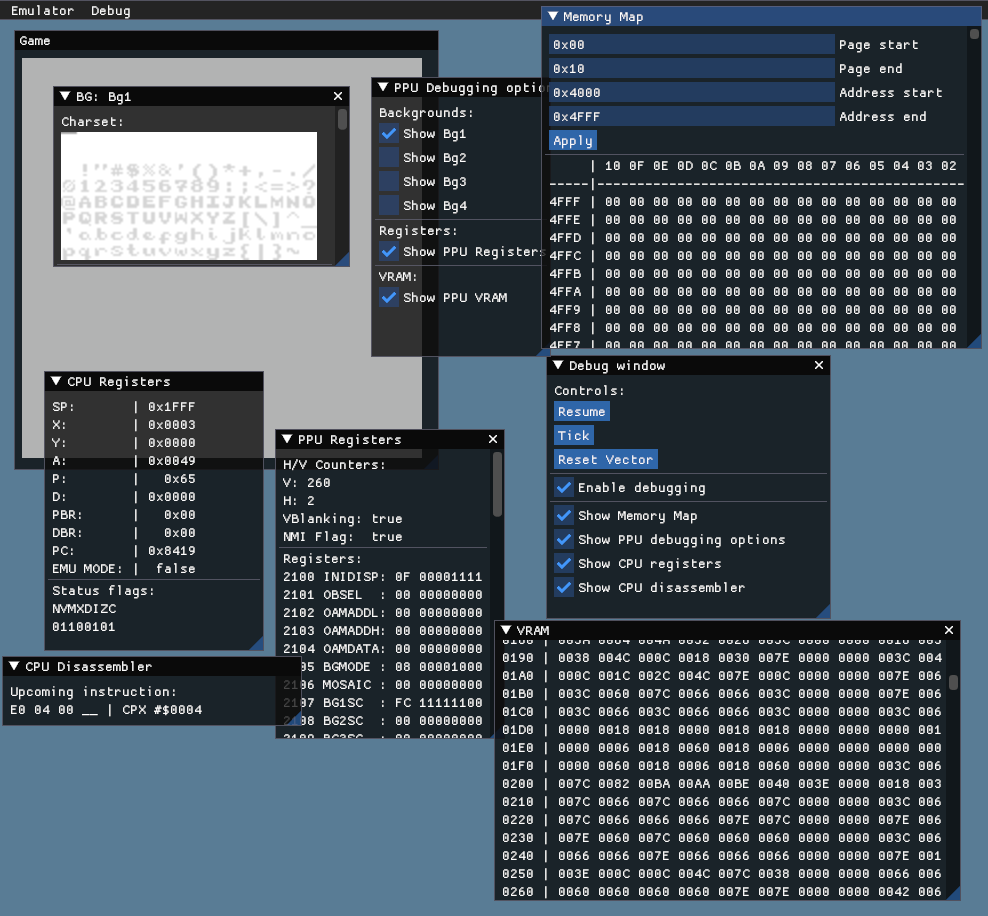

# SNES
Work in progress SNES emulator written in Rust.



## Install dependencies
For Debian-based distros, you will need to install these dependencies:
```
sudo apt install libgtk-3-dev
```

## Resources
* SNES General:
    * https://wiki.superfamicom.org
    * https://snesdev.mesen.ca/wiki/index.php
    * https://problemkaputt.de/fullsnes.htm
* 65816 CPU:
    * https://softpixel.com/~cwright/sianse/docs/65816NFO.HTM
    * https://ersanio.gitbook.io/assembly-for-the-snes
    * 65816 programming manual: https://www.nesdev.org/w/images/default/7/76/Programmanual.pdf
    * BCD addition and substraction: https://ehaskins.com/2018-01-30%20Z80%20DAA/
* Test ROMs
    * PeterLemon's test ROMs: https://github.com/PeterLemon/SNES
* Retro Game Mechanics Explained SNES playlists:
    * SNES general: https://www.youtube.com/playlist?list=PLHQ0utQyFw5KCcj1ljIhExH_lvGwfn6GV
    * SPC700: https://www.youtube.com/playlist?list=PLHQ0utQyFw5JD2wWda50J8XuzQ2cFr8RX